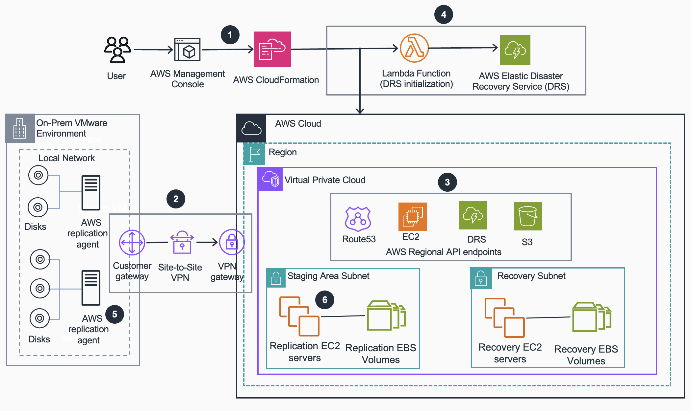

# Guidance for Disaster Recovery of VMware workloads on AWS using Elastic Disaster Recovery Service

This README describes the CloudFormation template and how to deploy and operate it in your AWS environment, in alignment with the accompanying [Prescriptive Guidance](PrescriptiveGuidance_ElasticDisasterRecovery.md).

## Table of Contents <!-- omit in toc -->

- [Overview](#overview)
- [Using this Guidance with AWS Elastic Disaster Recovery](#using-this-guidance-with-aws-elastic-disaster-recovery)
- [Key success criteria and example matrix](#key-success-criteria-and-example-matrix)
- [AWS Elastic Disaster Recovery configuration guidance](#aws-elastic-disaster-recovery-configuration-guidance)
- [Prerequisites](#prerequisites)
- [Template deployment steps](#template-deployment-steps)
- [Deployment Validation](#deployment-validation)
- [Running the Guidance and validating AWS Elastic Disaster Recovery](#running-the-guidance-and-validating-aws-elastic-disaster-recovery)
- [Cleanup](#cleanup)
- [Notices](#notices)
- [Authors](#authors)

This repository accompanies the AWS Prescriptive Guidance document [`PrescriptiveGuidance_AWSElasticDisasterRecovery.md`](PrescriptiveGuidance_AWSElasticDisasterRecovery.md), which explains how to use **AWS Elastic Disaster Recovery (AWS DRS)**, including background, architecture patterns, planning considerations, and end-to-end usage guidance. This README focuses on the **infrastructure-as-code implementation** of that Guidance. It explains what the `DRSPrivateBaseTemplate.yaml` CloudFormation template deploys and how to deploy and operate the private-connectivity environment in your AWS accounts to validate continuous replication, connectivity, and recovery behavior.

## Overview

This Guidance describes how to deploy an environment for **AWS Elastic Disaster Recovery** that uses **private connectivity** between your on-premises network and an AWS VPC. The CloudFormation template provisions connectivity by using an **AWS Site-to-Site VPN**. The underlying VPC and subnet design can be adapted to use an **AWS Direct Connect private virtual interface**, which you configure separately if your organization uses Direct Connect. The provided AWS CloudFormation template creates a target VPC, VPN components, VPC endpoints, and optional validation resources so that you can test AWS Elastic Disaster Recovery replication and recovery flows without routing traffic over the public internet.

The primary focus of this Guidance is **initializing AWS Elastic Disaster Recovery and preparing the target environment**. The template does **not** install the AWS Replication Agent or create replication servers; those are created later when you onboard source servers into AWS Elastic Disaster Recovery.

The CloudFormation template, `DRSPrivateBaseTemplate.yaml`, deploys the following resources:

- An **AWS VPC** that acts as the DRS **staging/target environment**, with:
  - A configurable CIDR block (default `192.168.100.0/22`).
  - Private subnets for DRS staging and recovery instances.
- An **AWS Site-to-Site VPN** between your on-premises network and the target VPC:
  - A **virtual private gateway (VGW)** in the AWS VPC.
  - A **customer gateway (CGW)** that uses your on-premises public IP.
  - Static routes for your on-premises CIDR.
- A set of **VPC endpoints** required for private DRS operation:
  - Interface endpoints for **AWS DRS**, **EC2**, **SSM**, **SSM Messages**, **EC2 Messages**, **CloudWatch Logs**, and **Secrets Manager**.
  - A gateway endpoint for **Amazon S3** for replication-related downloads.
- An optional **Route 53 Resolver inbound endpoint** to support DNS resolution of on-premises hostnames from AWS.
- An optional **Windows validation instance**:
  - Deployed into the target VPC with AWS Systems Manager (SSM) access (no public IP).
  - RDP credentials stored in AWS Secrets Manager.
  - Used for testing connectivity and failback flows.
- A **DRS initialization Lambda** function and IAM resources that:
  - Optionally call AWS Elastic Disaster Recovery APIs to initialize the service in the Region.
  - Configure **default replication settings** and a **launch configuration template** using parameters you supply (data plane routing, staging area tags, EBS encryption, and more).

This environment is not intended to be a complete production reference architecture. You should adapt the architecture design, best practices and parameter values based on your organization’s resilience, security, and compliance requirements.

### Architecture

This diagram illustrates the architecture that this Guidance deploys and how the key components interact.



At a high level, the diagram highlights the following:

1. You deploy the [createDRSIAM.yaml](./deployment/createDRSIAM.yaml) template first if AWS Elastic Disaster Recovery has never been initialized in your account, then deploy [DRSPrivateBaseTemplate.yaml](./deployment/DRSPrivateBaseTemplate.yaml) in your chosen AWS account and Region using the AWS Management Console.
2. The stack creates the AWS Site-to-Site VPN (virtual private gateway, customer gateway, VPN connection, and routes) for private connectivity; you then configure your on-premises VPN device using the downloaded VPN configuration.
3. Within the target VPC, the stack creates private subnets and the required VPC interface and gateway endpoints (for example, DRS, EC2, S3, SSM, Route 53, CloudWatch Logs, Secrets Manager) so service traffic stays on private connectivity.
4. A Lambda-backed custom resource initializes AWS Elastic Disaster Recovery and applies default replication and launch configuration settings based on the parameters you specify.
5. You install the AWS Replication Agent on selected VMware VMs in your on-premises environment so they register as source servers and can send changed data to AWS.
6. AWS Elastic Disaster Recovery uses the staging subnet to create replication EC2 servers and EBS staging volumes, and launches recovery EC2 instances and EBS volumes into the recovery subnet when you run drills or failover.

As described in the Overview, this architecture is a starting point. You should tailor the network design, parameters, and controls to your organization’s resilience, security, and compliance requirements.

### Cost

This environment uses multiple AWS services to support AWS Elastic Disaster Recovery, including networking (VPC, VPN, VPC endpoints, Route 53 Resolver), compute (validation instance and recovery instances), storage (EBS), and supporting services such as AWS Secrets Manager and AWS Systems Manager. All costs are incurred based on standard AWS pay-as-you-go pricing in the Region where you deploy the stack.

For a detailed, line-item estimate and assumptions, see:

- [`drs-infrastructure-cost-analysis.md`](drs-infrastructure-cost-analysis.md)

## Using this Guidance with AWS Elastic Disaster Recovery

When you adopt **AWS Elastic Disaster Recovery**, you should plan both how you will use the service and how you will evaluate whether it meets your objectives. This section describes a recommended approach for using this infrastructure Guidance together with the Elastic Disaster Recovery Prescriptive Guidance document, and provides an [example success criteria matrix](#key-success-criteria-and-example-matrix) you can adapt.

Refer to the companion Prescriptive Guidance document for broader context, planning guidance, and detailed service workflows:

- [PrescriptiveGuidance_ElasticDisasterRecovery.md](PrescriptiveGuidance_ElasticDisasterRecovery.md)

### 1. Plan scope and success criteria

Use the **Planning** section of the Prescriptive Guidance to align stakeholders, communication, documentation, activation criteria, KPIs, drill cadence, and preparation for failback:

- [Planning](PrescriptiveGuidance_ElasticDisasterRecovery.md#planning)

In addition to that broader planning, define what you want to validate in the environment created by this template:

- Identify 1–3 representative on-premises workloads (for example, a line-of-business application or a three-tier stack) that you will protect with AWS Elastic Disaster Recovery in this environment.
- Capture target **RPO/RTO**, expected network constraints, and security and compliance requirements for those workloads.
- Plan to exercise the following core scenarios, and document how you will measure success for each:
  - Initial replication and continuous replication state.
  - Non-disruptive recovery drills.
  - Production failover to AWS.
  - Failback from AWS to your on-premises environment.

You will use these scenarios and measurements when you interpret the results of your tests. The [example success criteria matrix](#key-success-criteria-and-example-matrix) later in this section shows one way to structure this information.

### 2. Prepare the network foundation

Use this Guidance to deploy the private-connectivity environment described in the **Overview** and **Architecture** sections:

- Deploy the `DRSPrivateBaseTemplate.yaml` template in a dedicated AWS account and Region.
- Configure your on-premises VPN device by using the tunnel configuration exported by the stack.
- Confirm basic connectivity (for example, ICMP, DNS, and HTTP/HTTPS where appropriate) between on-premises systems and the target VPC over the VPN or AWS Direct Connect.

If you are using Amazon Route 53 Resolver and the optional Windows validation instance, validate that DNS resolution and AWS Systems Manager access work as expected.

### 3. Onboard an initial set of servers to AWS Elastic Disaster Recovery

Using the **Technical Prerequisites** and **Installation** sections of the Prescriptive Guidance as a baseline, onboard a small, representative set of servers to AWS Elastic Disaster Recovery:

- [Technical Prerequisites](PrescriptiveGuidance_ElasticDisasterRecovery.md#technical-prerequisites)  
- [Installation](PrescriptiveGuidance_ElasticDisasterRecovery.md#installation)

When you onboard those servers in this environment:

- Install the AWS Replication Agent on the selected on-premises servers.
- Use **private data routing** (through the VPN or Direct Connect paths and the VPC endpoints created by this template) when you run the installer and when replication starts.
- Allow replication to reach a continuous replication state and validate that RPO metrics meet your expectations.

Use a combination of:

- **AWS Elastic Disaster Recovery metrics and logs**
- **Network telemetry** (for example, VPC Flow Logs, Site-to-Site VPN metrics, or Direct Connect CloudWatch metrics)

to confirm that replication and control-plane traffic are flowing through your private connectivity and endpoint architecture as intended.

### 4. Exercise recovery workflows

Use the **Drill Planning** and **Invoking Recovery** sections from the Prescriptive Guidance as references when testing recovery in this environment:

- [Drill Planning](PrescriptiveGuidance_ElasticDisasterRecovery.md#drill-planning)  
- [Invoking Recovery](PrescriptiveGuidance_ElasticDisasterRecovery.md#invoking-recovery)

In this environment:

- Perform non-disruptive recovery drills using AWS Elastic Disaster Recovery to launch recovery instances into the VPC created by this template.
- Validate connectivity, application behavior, and performance over the VPN or Direct Connect link.
- Measure RTO, cutover time, and any manual runbook effort required during each drill.

If you deployed the optional Windows validation instance, you can use it as a jump host or test client for your applications when running drills and recovery tests.

### 5. Evaluate results, failback, and iterate

Use your test results together with the **Failback** section of the Prescriptive Guidance to complete the full lifecycle:

- [Failback](PrescriptiveGuidance_ElasticDisasterRecovery.md#failback)

In particular:

- Compare your measured outcomes against the success criteria you defined in step 1 and the example matrix in the next subsection.
- Use the failback guidance, including the **Elastic Disaster Recovery Mass Failback Automation client (DRSFA)**, to plan and test how you will return workloads from AWS to your primary environment:
  - [Failback to on-premise vCenter using Elastic Disaster Recovery Mass Failback Automation client](PrescriptiveGuidance_ElasticDisasterRecovery.md#failback-to-on-premise-vcenter-using-elastic-disaster-recovery-mass-failback-automation-client)  
  - [DRSFA Client](PrescriptiveGuidance_ElasticDisasterRecovery.md#drsfa-client)
- Capture any gaps (for example, DNS cutover patterns, IAM hardening, cross-Region strategy, or operational runbooks) and refine the design accordingly.
- Decide which patterns validated in this environment should carry forward into your broader AWS Elastic Disaster Recovery implementation, including recovery and failback processes.

This structured approach helps you use the infrastructure defined in this Guidance to validate and refine your disaster recovery strategy, while the Prescriptive Guidance document provides the broader context and best practices for adopting AWS Elastic Disaster Recovery end to end.


## Key success criteria and example matrix

This section shows an example of how you can capture configuration details and results when you test AWS Elastic Disaster Recovery in this environment. You can copy and re-use this structure to maintain a separate matrix for each workload, application or server type.

### Scenario – Private-connectivity AWS Elastic Disaster Recovery deployment for VMware vSphere

#### Workload configuration

Capture the characteristics of the VMware workloads you are protecting so that results are comparable across runs.

| Item                                              | Value |
|---------------------------------------------------|-------|
| vSphere version (on-premises)                     |       |
| vCenter version                                   |       |
| Number of protected VMs                           |       |
| Application tiers in scope (for example, web/app/db)|     |
| Approximate total data set size (GB/TB)           |       |
| Typical daily change rate (%)                     |       |
| Network bandwidth between on-premises and AWS (for example, VPN or Direct Connect throughput) |       |
| RPO target                               |       |
| RTO target (per application or tier)     |       |
| Criticality (for example, Tier 0/1/2)             |       |

#### AWS Elastic Disaster Recovery configuration (this environment)

Use this section to record **environment-level settings** for each scenario, especially when you change parameters between scenarios. Most of these values come from the CloudFormation parameters and stack outputs; capturing them here makes it easier to compare scenarios and share context without re-inspecting the template.

| Item                                                | Value |
|-----------------------------------------------------|-------|
| AWS Region                                          |       |
| Data plane routing                                  | `PRIVATE_IP` (fixed default in this Guidance – change only if scenario differs) |
| Network connectivity                                | VPN / Direct Connect / both                         |
| Target VPC CIDR                                     | `192.168.100.0/22` (default – update if changed)    |
| Staging area subnets (IDs)                          |       |
| Recovery subnets (IDs)                              |       |
| Replication server instance type                    | `t3.small` (default – update if scenario differs)   |
| Default large staging disk EBS type                 | `AUTO` (default – update if scenario differs)       |
| Default launch configuration template (name/ID)     |       |
| Recovery instance subnets and security groups       |       |
| EBS encryption mode (DEFAULT / CMK)                 |       |
| KMS key ID/ARN (if CMK)                             |       |
| Tags for staging-area resources                     |       |
| Tags for recovered instances                        |       |

#### Protection and observability

Track whether protection is working as expected and whether traffic is flowing over private connectivity.

| Metric / check                                           | Target value / expectation                                                                | Measured value / notes |
|----------------------------------------------------------|-------------------------------------------------------------------------------------------|------------------------|
| AWS Replication Agent installation success rate          | 100%                                                                                      |                        |
| Initial sync duration (per workload or application type) | Within agreed window (for example, ≤ X hours; record a separate value for each matrix)    |                        |
| RPO for each workload                                   | ≤ RPO target                                                                              |                        |
| AWS Elastic Disaster Recovery console health            | No unresolved replication/recovery errors                                                |                        |
| Replication traffic path                                 | Traffic visible only over VPN/DX and VPC endpoints                                        |                        |
| Site-to-Site VPN / DX link utilization and stability     | Within capacity and stable                                                                |                        |
| VPC Flow Logs confirm private-only access to endpoints   | No direct internet path observed                                                          |                        |
| CloudWatch alarms for critical DRS / VPN / DX metrics    | Alarms configured and tested                                                              |                        |

#### Recovery and drill testing (recoverability)

Use this table when you perform non-disruptive drills and planned recovery tests.

| Metric / test                                           | Target value                                        | Measured value |
|---------------------------------------------------------|-----------------------------------------------------|----------------|
| Time to initiate a drill from “ready” state             | Within agreed operational target                    |                |
| Recovery instance launch success rate                   | 100%                                                |                |
| Recovery instance RTO per application/tier              | ≤ RTO target                               |                |
| Application smoke test result (per workload)            | All key paths succeed                               |                |
| Data consistency checks (for example, database checks)  | No data loss or corruption observed                 |                |
| DNS cutover / name resolution behavior                  | Clients resolve to correct recovery endpoints       |                |
| Ability to run drills during business hours (if allowed)| No unacceptable impact to production workloads      |                |

#### Failover and failback testing

Document how you validate full lifecycle recovery, including returning workloads to the primary environment, and how well your **post-launch actions** are documented and executed.

| Metric / test                                                                                                         | Target value                                         | Measured value |
|-----------------------------------------------------------------------------------------------------------------------|------------------------------------------------------|----------------|
| Planned failover cutover duration (to AWS)                                                                            | Within agreed maintenance window                     |                |
| User impact during planned failover                                                                                   | Within acceptable limits                             |                |
| Application post-launch actions (for example, DB recovery, service restarts, configuration updates)                   | All required actions documented and executed         |                |
| Successful use of Elastic Disaster Recovery Mass Failback Automation client (DRSFA) to orchestrate failback          | All targeted VMs processed successfully              |                |
| Time to complete failback from AWS to on-premises                                                                     | Within agreed failback window                        |                |
| Data parity after failback (for example, checksums, application-level validation)                                     | No unexplained discrepancies                         |                |
| Ability to re-protect workloads with AWS Elastic Disaster Recovery after failback                                                           | All required servers successfully re-onboarded       |                |
| Runbooks updated with post-launch and failback sequencing, approvals, and communication steps                         | All gaps documented and actioned                     |                |

#### Functional and operational testing

Capture qualitative outcomes that do not fit neatly into numeric metrics but are important for adoption and operations.

| Feature / behavior                                             | Expected outcome                                             | Observed outcome |
|----------------------------------------------------------------|--------------------------------------------------------------|------------------|
| Private-only connectivity for replication and control plane    | No dependency on public internet paths                       |                  |
| Route 53 Resolver behavior (if used)                           | On-premises and AWS workloads resolve required hostnames     |                  |
| IAM roles and permissions for DRS, Lambda, and endpoints       | Least-privilege access aligned with organizational standards |                  |
| Operational runbooks for drills, failover, and failback        | Clear, repeatable, and tested                                |                  |
| Monitoring and alerting integration (for example, EventBridge) | Operations team can detect and respond to issues promptly    |                  |
| Stakeholder communication and approval workflow                | Matches expectations defined in the Planning phase           |                  |

## AWS Elastic Disaster Recovery configuration guidance

This section lists the **AWS Elastic Disaster Recovery** configuration options that this Guidance helps you control, and the defaults used in `DRSPrivateBaseTemplate.yaml`. Each item includes links to deeper explanations in the VMware solution guidance and the AWS Elastic Disaster Recovery User Guide.

### Replication settings (staging area, bandwidth, encryption, PiT retention)

**What you can configure**

Through the `InitializeDRS` Lambda-backed custom resource and the template parameters, you configure default replication settings for newly protected servers, including:

- **Staging area behavior and tags** – which AWS account/Region and subnets host the staging area, and how replication resources are tagged (`StagingAreaTags`, `AdditionalTags`).  
- **Automatic disk coverage** – whether new disks attached to protected servers are automatically added to replication (`AutoReplicateNewDisks`).  
- **Bandwidth throttling** – an optional Mbps limit for replication traffic from source to AWS (`BandwidthThrottling`).  
- **EBS encryption** – whether staging-area EBS volumes use the default AWS-managed key or a customer-managed KMS key (`EbsEncryption`, `EbsEncryptionKeyArn`).  
- **Default large staging disk type** – EBS volume type used for large staging disks (`DefaultLargeStagingDiskType`).  
- **Daily Point-in-Time (PiT) retention** – the number of **daily** recovery points that AWS Elastic Disaster Recovery retains (`PitPolicyDaily`). This parameter controls only the daily layer; the 10-minute and hourly layers follow AWS Elastic Disaster Recovery defaults.

**Default in this Guidance (template parameters)**

- `AutoReplicateNewDisks` = `True` (new disks are included automatically).  
- `BandwidthThrottling` = `0` (no throttling by default; replication uses available bandwidth).  
- `EbsEncryption` = `DEFAULT` (EBS volumes encrypted with the default AWS-managed key).  
- `EbsEncryptionKeyArn` = `DefaultKey` (you can override with a CMK ARN when `EbsEncryption=CUSTOM`).  
- `DefaultLargeStagingDiskType` = `AUTO`.  
- `PitPolicyDaily` = `7` (retain 7 daily PiT recovery points; can be adjusted between 1 and 365 days).

**Where to read more**

- [Staging area subnet](PrescriptiveGuidance_ElasticDisasterRecovery.md#staging-area-subnet)  
- [Replication server](PrescriptiveGuidance_ElasticDisasterRecovery.md#replication-server)  
- [Point in time (PiT) snapshots](PrescriptiveGuidance_ElasticDisasterRecovery.md#point-in-time-pit-snapshots)  
- [Replication settings – AWS Elastic Disaster Recovery User Guide](https://docs.aws.amazon.com/drs/latest/userguide/replication-settings.html)

### Network routing and connectivity for replication

**What you can configure**

This Guidance focuses on using **private connectivity** for both control-plane and data-plane traffic. Through the template parameters and infrastructure, you control:

- **Data plane routing** – whether replication uses private IPs or public IPs (`DataPlaneRouting`).  
- **Public IP allocation for replication servers** – whether DRS is allowed to create public IPs for replication servers (`CreatePublicIP`).  
- **Security group association** – whether to associate the default security group to DRS-created resources (`AssociateDefaultSecurityGroup`).  
- **Replication path** – whether connectivity is via AWS Site-to-Site VPN, AWS Direct Connect, or both, and which VPC/subnets and endpoints are used for traffic.

**Default in this Guidance**

- `DataPlaneRouting` = `PRIVATE_IP` (replication traffic is routed over private connectivity).  
- `CreatePublicIP` = `False` (no public IPs for replication servers).  
- `AssociateDefaultSecurityGroup` = `True` (the default VPC security group is associated unless you change this setting).  
- Replication uses:
  - A dedicated target VPC with private subnets,  
  - VPC interface endpoints for DRS, EC2, SSM, CloudWatch Logs, and Secrets Manager, and  
  - An S3 gateway endpoint for replication-related downloads.

**Where to read more**

- [Architecture](PrescriptiveGuidance_ElasticDisasterRecovery.md#architecture)  
- [Core Concepts](PrescriptiveGuidance_ElasticDisasterRecovery.md#core-concepts)  
- [Source server](PrescriptiveGuidance_ElasticDisasterRecovery.md#source-server)  
- [Staging area subnet](PrescriptiveGuidance_ElasticDisasterRecovery.md#staging-area-subnet)

### Launch configuration template and runtime behavior

**What you can configure**

The template uses a Lambda function to set a **default launch configuration template** for AWS Elastic Disaster Recovery. This template controls how recovery and drill instances are launched, including:

- **Launch disposition** – whether recovery instances start as `STOPPED` or `STARTED` (`LaunchDisposition`).  
- **Re-IP behavior** – whether private IP addresses are copied from the source (`CopyPrivateIp`).  
- **Tag propagation and target tags** – whether tags are copied from source servers (`CopyTags`) and which additional tags are applied to target instances (`TargetTags`).  
- **Instance type strategy** – whether to use basic or in-AWS right-sizing, or to keep the chosen instance type as-is (`TargetInstanceTypeRightSizingMethod`, `TargetInstanceType`).  
- **Licensing mode** – whether to enable BYOL for Windows (`OsByol`).  
- **Launch destination** – whether to launch into a specific EC2 instance (`LaunchIntoSourceInstance`) when applicable.  
- **Post-launch actions** – whether post-launch actions are enabled (`PostLaunchEnabled`), allowing you to configure runbooks in the DRS console (for example, OS configuration, application startup scripts).

**Default in this Guidance (template parameters)**

- `LaunchDisposition` = `STARTED` (recovery instances are launched in a running state).  
- `CopyPrivateIp` = `False` (no re-IP from source by default; you can adjust for your network design).  
- `CopyTags` = `False` (tags are not copied automatically; see tagging guidance below).  
- `TargetInstanceTypeRightSizingMethod` = `NONE` (no automatic right-sizing; the specified instance type is used).  
- `TargetInstanceType` = `m5.xlarge` (default recovery instance type; adjust for your workloads).  
- `OsByol` = `False` (no BYOL enabled by default).  
- `LaunchIntoSourceInstance` = `False`.  
- `PostLaunchEnabled` = `True` (post-launch actions are enabled so you can configure them later in the console).

**Where to read more**

- [Recovery subnet](PrescriptiveGuidance_ElasticDisasterRecovery.md#recovery-subnet)  
- [Drills](PrescriptiveGuidance_ElasticDisasterRecovery.md#drills)  
- [Drill Planning](PrescriptiveGuidance_ElasticDisasterRecovery.md#drill-planning)  
- [Invoking Recovery](PrescriptiveGuidance_ElasticDisasterRecovery.md#invoking-recovery)  
- [Launch settings overview – AWS Elastic Disaster Recovery User Guide](https://docs.aws.amazon.com/drs/latest/userguide/launch-settings-overview.html)

### Tagging for staging and recovered resources

**What you can configure**

Tagging is important for cost allocation, governance, and automation. This Guidance exposes parameters that let you tag both the **staging area** and **recovered instances**:

- **Staging area tags** – applied to replication servers, staging disks, and related resources (`StagingAreaTags`, `AdditionalTags`).  
- **Target instance tags** – applied to recovery and drill instances launched from DRS (`TargetTags`).

These tags can be aligned with your existing cost allocation, environment, or criticality taxonomy.

**Default in this Guidance (template parameters)**

- `StagingAreaTags` = `Resource=StagingArea`.  
- `AdditionalTags` = `Project=DisasterRecovery`.  
- `TargetTags` = `Resource=Target` (recovery instances are tagged to distinguish them from other EC2 workloads).

**Where to read more**

- [Architecture](PrescriptiveGuidance_ElasticDisasterRecovery.md#architecture)  
- [Cost optimization](PrescriptiveGuidance_ElasticDisasterRecovery.md#cost-optimization)  
- [Source server](PrescriptiveGuidance_ElasticDisasterRecovery.md#source-server)  
- [Recovery instance](PrescriptiveGuidance_ElasticDisasterRecovery.md#recovery-instance)

### Using these settings in your own environment

The defaults in this Guidance are intended as a **starting point** for a private-connectivity deployment of AWS Elastic Disaster Recovery. When you adapt this template for your own environment, consider:

- Adjusting `PitPolicyDaily` to align with your recovery point requirements and storage budget.  
- Tuning `BandwidthThrottling` and validating network bandwidth between on-premises and AWS using the **Key success criteria and example matrix** section.  
- Choosing `EbsEncryption=CUSTOM` and specifying a CMK ARN where your organization requires customer-managed keys.  
- Updating `TargetInstanceType`, `LaunchDisposition`, and `TargetInstanceTypeRightSizingMethod` to reflect each workload’s performance and operational expectations.  
- Aligning `StagingAreaTags`, `AdditionalTags`, and `TargetTags` with your enterprise tagging standards (for example, `Environment`, `Application`, `Owner`, `CostCenter`).  
- Revisiting `CreatePublicIP` and `AssociateDefaultSecurityGroup` to ensure that replication resources comply with your network and security controls.

Use this section together with the **Key success criteria and example matrix** and the VMware solution guidance to document how you configure AWS Elastic Disaster Recovery, and to ensure that any changes to these settings are deliberate, reviewable, and testable over time.

## Prerequisites

This section summarizes what you need in place before deploying `DRSPrivateBaseTemplate.yaml` and onboarding servers to AWS Elastic Disaster Recovery.

### Test data

These files give you a simple, repeatable way to verify that new data is replicated and to get an intuitive feel for RPO and change rates when you monitor AWS Elastic Disaster Recovery metrics and logs. 

These scripts:

- Take **file size (in MiB)** and **number of files** as input.
- Create files whose **names and contents include a timestamp to the second**.
- Ensure each file is approximately the requested size (for example, 1 MiB).

#### Linux script (bash)

Save the following as `drs-generate-test-data.sh` on a Linux VM:

```
#!/bin/bash
# Usage: ./drs-generate-test-data.sh <size_mb> <file_count>
# Example: ./drs-generate-test-data.sh 1 100   # 100 files, 1 MiB each

set -euo pipefail

SIZE_MB="${1:-1}"
FILE_COUNT="${2:-20}"

SIZE_BYTES=$((SIZE_MB * 1024 * 1024))
TARGET_DIR="/var/tmp/drs-test"

mkdir -p "$TARGET_DIR"

echo "Generating $FILE_COUNT files of ${SIZE_MB} MiB in $TARGET_DIR"

for ((i=1; i<=FILE_COUNT; i++)); do
  ts=$(date +"%Y-%m-%d_%H-%M-%S")
  path="${TARGET_DIR}/file-${ts}.txt"
  content="DRS test file created at ${ts}\n"

  # Repeat the content and truncate to the desired size
  yes "$content" | head -c "$SIZE_BYTES" > "$path"

  echo "Created $path (~${SIZE_MB} MiB)"
  sleep 1
done

echo "Done."
```

**Example usage:**
```
chmod +x drs-generate-test-data.sh
./drs-generate-test-data.sh 1 100

```

#### Windows script (PowerShell)

Save the following as drs-generate-test-data.ps1 on a Windows VM:

```
param(
    [int]$FileSizeMB = 1,
    [int]$FileCount  = 20
)

$targetDir = "C:\drs-test"
New-Item -ItemType Directory -Path $targetDir -Force | Out-Null

$sizeBytes = $FileSizeMB * 1MB

Write-Host "Generating $FileCount files of $FileSizeMB MiB in $targetDir"

for ($i = 1; $i -le $FileCount; $i++) {
    $ts   = Get-Date -Format "yyyy-MM-dd_HH-mm-ss"
    $path = Join-Path $targetDir "file-$ts.txt"
    $content = "DRS test file created at $ts`r`n"

    # Build a string big enough, then trim and write as bytes to control size
    $repetitions = [math]::Ceiling($sizeBytes / $content.Length)
    $full = ($content * $repetitions)
    $bytes = [Text.Encoding]::UTF8.GetBytes($full)
    if ($bytes.Length -gt $sizeBytes) {
        $bytes = $bytes[0..($sizeBytes - 1)]
    }

    [IO.File]::WriteAllBytes($path, $bytes)
    Write-Host "Created $path (~$FileSizeMB MiB)"
    Start-Sleep -Seconds 1
}

Write-Host "Done."
```

**Example usage (from an elevated PowerShell prompt):**

```
Set-ExecutionPolicy -ExecutionPolicy RemoteSigned -Scope Process -Force
.\drs-generate-test-data.ps1 -FileSizeMB 1 -FileCount 100
```
These files give you a simple, repeatable way to verify that new data is replicated and to get an intuitive feel for RPO and change rates when you monitor AWS Elastic Disaster Recovery metrics and logs.

### On-premises VMware environment

This Guidance is designed for **on-premises VMware vSphere** environments. Before you start:

- Ensure you have:
    - A supported vSphere and vCenter version.
    - VMware VMs running supported Windows or Linux operating systems.
    - Administrative access to install the **AWS Replication Agent** on source servers.
- Confirm that your on-premises environment meets the **technical prerequisites** and **network requirements** described in the Prescriptive Guidance and AWS Elastic Disaster Recovery User Guide (for example, bandwidth, ports, and staging subnet requirements).

For detailed requirements, review:

  - [Technical Prerequisites](PrescriptiveGuidance_ElasticDisasterRecovery.md#technical-prerequisites)
  - [Network requirements – AWS Elastic Disaster Recovery User Guide](https://docs.aws.amazon.com/drs/latest/userguide/Network-Requirements.html)

### Networking and connectivity (staging VPC)

This Guidance creates the **AWS-side network foundation** (a staging VPC) for private-only DRS traffic:

  - A dedicated **VPC** using TargetVpcCidrBlock (default 192.168.100.0/22).
  - **Private subnets** (PrivateSubnet0, PrivateSubnet1) and **public subnets** (PublicSubnet0, PublicSubnet1).
      - PrivateSubnet0 is used as the **staging subnet** for AWS Elastic Disaster Recovery (replication servers and staging disks).
  - **Route tables** and routes for the private and public subnets.
  - An **AWS Site-to-Site VPN**:
      - Virtual private gateway (VGW) attached to the VPC.
      - Customer gateway (CGW) using your on-premises public IP (OnPremPublicIP).
      - VPN connection with **static routes** to your on-premises CIDR (OnPremCidrBlock).
  - **VPC endpoints**:
      - S3 **gateway** endpoint and **interface** endpoint.
      - Interface endpoints for **SSM**, **SSM Messages**, **EC2 Messages**, **EC2**, **CloudWatch Logs**, **DRS**, and **Secrets Manager**.
  - **Security groups** for:
      - VPC endpoints, staging resources, recovered instances, optional Windows validation instance, and optional Route 53 Resolver inbound endpoint.

The template does **not** create an Internet Gateway or NAT Gateway. All outbound connectivity for replication and control-plane traffic uses:
  - The Site-to-Site VPN or Direct Connect path, and
  - VPC endpoints to reach S3, DRS, EC2, SSM, CloudWatch Logs, and Secrets Manager.

On the **on-premises** side, you must:
  - Own or control the static public IP used as OnPremPublicIP.
  - Ensure OnPremCidrBlock does **not overlap** with TargetVpcCidrBlock.
  - Configure your VPN device with the tunnel configuration generated by the stack.
  - Allow at least:
      - **TCP 443** between source servers and AWS DRS/VPC endpoints.
      - **TCP 1500** between source servers and the staging subnet (DRS data replication channel).

For background, see: [Technical Prerequisites – Network requirements](PrescriptiveGuidance_ElasticDisasterRecovery.md#technical-prerequisites)

#### Testing connectivity to VPC endpoints (TCP 443)

To verify connectivity from on-premises servers to the VPC endpoints:
  1. In the AWS Management Console, go to **VPC → Endpoints**.
  2. Select the endpoint you want to test (for example, the S3 or DRS interface endpoint).
  3. Copy one of the **DNS names** (for example,vpce-abcdefghijklmnopq-12345678.s3.us-west-2.vpce.amazonaws.com).

If you have nc/netcat available (Linux, or Windows with netcat installed):

`nc -vz vpce-abcdefghijklmnopq-12345678.s3.us-west-2.vpce.amazonaws.com 443`

A successful connection shows output such as succeeded (exact wording depends on your nc version).

On Windows without netcat, you can use PowerShell:

`Test-NetConnection -ComputerName "vpce-abcdefghijklmnopq-12345678.s3.us-west-2.vpce.amazonaws.com" -Port 443`

Repeat this for key endpoints such as S3 and DRS.

#### Testing connectivity on TCP 1500 using the Windows validation instance

By default, DRS data replication flows from source servers to the staging subnet over **TCP 1500**. To validate that this path works end-to-end, you can:

  1. Deploy the template with CreateWindowsInstance = "yes".
  2. Connect to the **Windows validation instance** in PrivateSubnet0.
  3. Start a simple TCP listener on **port 1500** on the Windows validation instance.
  4. From an on-premises server, attempt to connect to that listener over port 1500.

On the Windows validation instance (PowerShell – start a TCP listener on port 1500):

```
$port = 1500  
$listener = [System.Net.Sockets.TcpListener]::new([Net.IPAddress]::Any, $port)  
$listener.Start()  
Write-Host "Listening on port $port ..."  

$client = $listener.AcceptTcpClient()  
Write-Host "Connection received from $($client.Client.RemoteEndPoint)"  

# To keep listening for additional tests, you can wrap AcceptTcpClient in a loop.
```

From an on-premises Linux server (test connectivity to the Windows validation instance private IP):

`nc -vz <WindowsValidationInstancePrivateIP> 1500`

From an on-premises Windows server (without netcat):

`Test-NetConnection -ComputerName "<WindowsValidationInstancePrivateIP>" -Port 1500`

A successful test confirms that:
  - VPN routing is working end to end.
  - Security groups and network ACLs permit the required DRS data channel path on TCP 1500.

### AWS Elastic Disaster Recovery service setup

Before you rely on this environment for disaster recovery:
  - Confirm that **AWS Elastic Disaster Recovery** is available and permitted in the Region where you deploy the stack.
  - **If AWS Elastic Disaster Recovery has never been initialized in your AWS account**, you must first deploy the [createDRSIAM.yaml](./deployment/createDRSIAM.yaml) CloudFormation template. This template creates the required IAM service-linked roles and permissions that AWS Elastic Disaster Recovery needs to operate in your account. Deploy this template **before** deploying `DRSPrivateBaseTemplate.yaml`.
  - Decide whether you want the template to **initialize AWS Elastic Disaster Recovery for you** or if you will configure it manually:
      - InitializeDRS = Yes (default): the ElasticDisasterRecoveryServiceInitializationFunction Lambda function:
          - Calls drs:InitializeService if needed.
          - Applies default replication and launch configuration settings based on the parameters in this template.
      - InitializeDRS = No: the template does not change AWS Elastic Disaster Recovery settings; you must configure replication and launch templates directly in the DRS console or via your own automation.

For broader service setup and workflows, see:
  - What is AWS Elastic Disaster Recovery?
  - [Technical Prerequisites](PrescriptiveGuidance_ElasticDisasterRecovery.md#technical-prerequisites)
  - [Installation](PrescriptiveGuidance_ElasticDisasterRecovery.md#installation)

### Operating system and validation instance

Your **source servers** (VMware VMs) must run supported Windows or Linux OS versions for the AWS Replication Agent. See the AWS Elastic Disaster Recovery User Guide for the most up-to-date matrix of supported operating systems.

This template can optionally deploy a **Windows validation instance** in the **staging VPC**:
  - Controlled by CreateWindowsInstance (default "yes").
  - Uses the latest Windows Server 2019 AMI from the public SSM parameter store.
  - Launches as a t3.small instance in PrivateSubnet0 (the staging subnet).
  - Uses AWS Systems Manager (via the AmazonSSMManagedInstanceCore policy) instead of a public IP.
  - Retrieves RDP credentials from the DRSCredentialsSecret secret, which is populated from the RDPUsername and RDPPassword parameters.

If you enable the validation instance:
  - Provide an RDPPassword that meets Windows password complexity requirements.
  - Ensure your organization permits Windows Server usage in the chosen Region.

### AWS account and IAM requirements

You must deploy this template into an AWS account where you have:
  - Access to the **AWS Management Console** (or equivalent automation) to create a CloudFormation stack.
  - Permissions to create and manage the resources defined in DRSPrivateBaseTemplate.yaml, including (but not limited to):
      - **Networking**: VPC, subnets, route tables, VPN gateway, customer gateway, VPN connection, VPC endpoints, security groups, and routes.
      - **Name resolution and secrets**: AWS Secrets Manager secrets (for credentials) and Route 53 / Route 53 Resolver resources (if CreateRoute53Resolver = "yes").
      - **Compute and management**: EC2 instances (for the optional Windows validation instance), IAM roles and instance profiles, Lambda functions, and CloudFormation custom resources.
      - **AWS Elastic Disaster Recovery service roles and APIs**: ability to:
          - Create roles that attach the AWS-managed Elastic Disaster Recovery policies (for example, AWSElasticDisasterRecoveryReplicationServerPolicy, AWSElasticDisasterRecoveryRecoveryInstancePolicy).
          - Allow the initialization Lambda to call DRS APIs such as drs:InitializeService, drs:CreateReplicationConfigurationTemplate, and drs:CreateLaunchConfigurationTemplate.
          - Use iam:PassRole for the roles referenced by the Lambda and DRS service.

If you want to validate your permissions from a Linux/macOS shell (similar to the AWS Backup README), you can use aws iam simulate-principal-policy with your current identity.

Get the caller identity ARN:

`MYARN="$(aws sts get-caller-identity --query Arn --output text)"`

`echo "$MYARN"`

Core CloudFormation & IAM pass role:

`aws iam simulate-principal-policy --policy-source-arn "$MYARN" --action-names "cloudformation:CreateStack" "cloudformation:DescribeStacks" | grep -i decision` 

`aws iam simulate-principal-policy --policy-source-arn "$MYARN" --action-names "iam:CreateRole" "iam:CreateInstanceProfile" "iam:AttachRolePolicy" "iam:PassRole" | grep -i decision`

Networking (VPC, VPN, endpoints, security groups):

`aws iam simulate-principal-policy --policy-source-arn "$MYARN" --action-names "ec2:CreateVpc" "ec2:CreateSubnet" "ec2:CreateRouteTable" "ec2:CreateRoute" "ec2:CreateSecurityGroup" "ec2:CreateTags" "ec2:CreateVpcEndpoint" "ec2:CreateCustomerGateway" "ec2:CreateVpnGateway" "ec2:CreateVpnConnection" "ec2:ModifyVpcAttribute" | grep -i decision`

Compute, Lambda, and Secrets Manager:

`aws iam simulate-principal-policy --policy-source-arn "$MYARN" --action-names "ec2:RunInstances" "lambda:CreateFunction" "lambda:UpdateFunctionCode" "lambda:AddPermission" "secretsmanager:CreateSecret" "secretsmanager:PutSecretValue" | grep -i decision`

Route 53 and Route 53 Resolver (if enabled):

`aws iam simulate-principal-policy --policy-source-arn "$MYARN" --action-names "route53:CreateHostedZone" "route53:ChangeResourceRecordSets" "route53resolver:CreateResolverEndpoint" | grep -i decision`

AWS Elastic Disaster Recovery APIs:

`aws iam simulate-principal-policy --policy-source-arn "$MYARN" --action-names "drs:InitializeService" "drs:CreateReplicationConfigurationTemplate" "drs:CreateLaunchConfigurationTemplate" "drs:GetReplicationConfiguration" "drs:GetLaunchConfiguration" "drs:DescribeSourceServers" | grep -i decision`

These commands are **examples** you can adapt; they do not cover every action in the template but help you quickly confirm that your principal is broadly authorized to create the core networking, IAM, Lambda, Secrets Manager, Route 53, and DRS resources required by DRSPrivateBaseTemplate.yaml.

## Template deployment steps

### Deploying the private DRS environment using CloudFormation

Deploy the CloudFormation templates from this repository:

| Template | Description |
| --- | --- |
| [createDRSIAM.yaml](./deployment/createDRSIAM.yaml) | **Deploy this first if AWS Elastic Disaster Recovery has never been initialized in your account.** Creates the required IAM service-linked roles and permissions for AWS Elastic Disaster Recovery to operate. |
| [DRSPrivateBaseTemplate.yaml](./deployment/DRSPrivateBaseTemplate.yaml) | Creates a dedicated staging VPC (with private and public subnets), Site-to-Site VPN components (VGW, CGW, VPN connection), required VPC endpoints for private-only operation, optional Windows validation instance, optional Route 53 Resolver inbound endpoint, and a Lambda function that can initialize AWS Elastic Disaster Recovery and apply default replication and launch configuration settings. |

This template prepares the AWS-side environment. It does not install the AWS Replication Agent or create replication servers. Those are created later when you onboard source servers into AWS Elastic Disaster Recovery, as described in [PrescriptiveGuidance_ElasticDisasterRecovery.md](PrescriptiveGuidance_ElasticDisasterRecovery.md).

  1.  Open the AWS CloudFormation console and choose Create stack → With new resources (standard).
  2.  Under Specify template, choose Upload a template file and select DRSPrivateBaseTemplate.yaml from this repository.
  3.  Provide a stack name, for example drs-private-base-target, and set parameters as described in Template parameters below.
  4.  Choose Next, optionally add stack tags, then review the configuration, acknowledge required capabilities, and choose Create stack.
  5.  Wait for the stack to reach CREATE_COMPLETE.
  6.  In the Outputs tab, record the values listed under Stack outputs below for later steps and connectivity checks.

* * * * *

### Template parameters (reference)

#### Core networking and environment parameters

| Parameter | Purpose | Suggested value or default |
| --- | --- | --- |
| TargetVpcCidrBlock | CIDR block for the VPC used as the DRS staging or target environment. | 192.168.100.0/22 (adjust to fit your IP plan) |
| OnPremPublicIP | Static public IP address of your on-premises VPN device. | Your on-premises VPN device public IP |
| OnPremCidrBlock | CIDR block of your on-premises network reachable over the VPN. | Your on-premises CIDR (must not overlap with VPC CIDR) |
| CreateWindowsInstance | Whether to create a Windows validation instance in PrivateSubnet0. | Yes in most deployments where you want a built-in instance for connectivity and application validation; No to skip |
| RDPUsername | Username for RDP access to the Windows validation instance (if created). | An admin username such as drsadmin |
| RDPPassword | Password for RDP access (only required if CreateWindowsInstance is set to yes). | Strong password meeting Windows complexity rules |
| CreateRoute53Resolver | Whether to create a Route 53 Resolver inbound endpoint to resolve on-premises hostnames from AWS. | yes if you need DNS from AWS to on-prem; otherwise no |

* * * * *

#### DRS initialization and core behavior

| Parameter | Purpose | Suggested value or default |
| --- | --- | --- |
| InitializeDRS | Initialize AWS Elastic Disaster Recovery in this Region and create default replication and launch configuration templates. | Yes if DRS is not already initialized |
| DataPlaneRouting | Routing mechanism for replication traffic. | PRIVATE_IP to keep traffic on private connectivity |
| BandwidthThrottling | Maximum bandwidth (Mbps) used by the DRS replication data plane. | 0 (no throttling) for tests; tune if needed |
| AutoReplicateNewDisks | Automatically include newly attached disks on protected servers in replication. | True |
| AssociateDefaultSecurityGroup | Associate the default security group for replication servers and staging disks. | True (you can tighten later) |
| EbsEncryption | Controls whether EBS volumes use default encryption or a specific KMS key. | DEFAULT for most environments |
| EbsEncryptionKeyArn | KMS key ARN to use when a custom encryption key is required. | Leave blank to use the default key, or specify a CMK |
| PitPolicyDaily | Number of days to retain daily points-in-time for recovery. | 7 (can be adjusted between 1 and 365) |

* * * * *

#### Replication server and tagging parameters

| Parameter | Purpose | Suggested value or default |
| --- | --- | --- |
| ReplicationServerInstanceType | EC2 instance type used for replication servers. | t3.small as a good default for small-scale or initial deployments; increase size for higher-throughput or larger-scale environments |
| UseDedicatedReplicationServer | Use a dedicated replication server per source server instead of sharing. | False for most deployments; set to True only when you require a dedicated replication server per source server (for example, for specific performance or isolation requirements) |
| StagingAreaTags | Tags applied to staging area resources such as replication servers and staging disks. | For example, Resource=StagingArea |
| AdditionalTags | Additional tags applied to staging resources. | For example, Project=DisasterRecovery |
| CopyTags | Copy tags from source servers to recovery instances. | False initially (enable later if needed) |
| CopyPrivateIp | Copy private IP from source to recovery instance where possible. | False by default; enable only if your network design requires preserving source private IP addresses on recovery instances. |

* * * * *

#### Launch configuration and target instance behavior

| Parameter | Purpose | Suggested value or default |
| --- | --- | --- |
| LaunchDisposition | Whether recovery instances are started or left stopped after launch. | STARTED for interactive testing |
| TargetInstanceTypeRightSizingMethod | Whether to right-size recovery instances based on observed characteristics. | NONE initially; consider BASIC or IN_AWS later |
| TargetInstanceType | EC2 instance type for recovery instances when right-sizing is set to NONE. | t3.small or another instance type that matches your workload’s performance and disaster recovery objectives. |
| OsByol | Enable Bring-Your-Own-License behavior for supported operating systems. | False unless you require BYOL |
| PostLaunchEnabled | Enable post-launch actions (for example, SSM Automation runbooks) for recovery instances. | True |
| TargetTags | Tags applied to recovery instances created by DRS. | For example, Resource=Target |

* * * * *

#### Stack outputs

After the stack reaches CREATE_COMPLETE, use the Outputs tab to capture key values.

| Output | Description | What you might use it for |
| --- | --- | --- |
| VpcId | ID of the created VPC. | Network checks and future subnet or endpoint additions |
| PrivateSubnetId0 | ID of private subnet 0 (staging subnet). | Staging subnet for replication servers and validation instance |
| PrivateSubnetId1 | ID of private subnet 1. | Additional private capacity or multi-AZ patterns |
| PrivateRouteTableId | ID of the private route table. | Verifying routes to VPN and VPC endpoints |
| WebSecurityGroupId | Security group used by the Windows validation instance. | Adjusting inbound rules for validation and troubleshooting |
| RecoveredInstanceSecurityGroupId | Security group intended for recovered instances. | Hardening access to recovery workloads |
| DrsEndpointDNS or DrsEndpointDnsEntries | DNS name or names for the DRS interface endpoint. | Connectivity tests from on-premises to the DRS endpoint |
| S3InterfaceEndpointDnsEntries | DNS entries for the S3 interface endpoint. | Connectivity tests to S3 via private connectivity |
| SecretsManagerSecret | Name of the AWS Secrets Manager secret that stores RDP credentials. | Connecting securely to the Windows validation instance |
| ResolverInboundEndpointIPs | IP addresses of the Route 53 Resolver inbound endpoint (if created). | On-premises DNS forwarder configuration |
| ResolverInboundEndpointId | ID of the Route 53 Resolver inbound endpoint (if created). | Operations and troubleshooting in Route 53 Resolver |

* * * * *

### Post-deploy: connect on-premises and validate

After the stack is deployed:
  -   Configure your VPN device using the downloaded Site-to-Site VPN configuration, and verify that routes between OnPremCidrBlock and TargetVpcCidrBlock are active.
  -   From on-premises, resolve and test connectivity to key VPC endpoint DNS names (for example, S3, DRS, EC2, SSM) to confirm that traffic stays on the private path (VPN or Direct Connect).
  -   Use PrivateSubnetId0 and RecoveredInstanceSecurityGroupId to validate that staging resources and recovered instances can reach required AWS services via VPC endpoints, and that on-premises servers can reach the staging subnet on required ports such as TCP 1500.
  -   If InitializeDRS is set to Yes, review the default replication and launch configuration templates in the AWS Elastic Disaster Recovery console and align them with the guidance in the AWS Elastic Disaster Recovery configuration guidance section and the Planning, Technical Prerequisites, Installation, Drill Planning, and Invoking Recovery sections of PrescriptiveGuidance_ElasticDisasterRecovery.md:
      -   [Planning](PrescriptiveGuidance_ElasticDisasterRecovery.md#planning)
      -   [Technical Prerequisites](PrescriptiveGuidance_ElasticDisasterRecovery.md#technical-prerequisites)
      -   [Installation](PrescriptiveGuidance_ElasticDisasterRecovery.md#installation)
      -   [Drill Planning](PrescriptiveGuidance_ElasticDisasterRecovery.md#drill-planning)
      -   [Invoking Recovery](PrescriptiveGuidance_ElasticDisasterRecovery.md#invoking-recovery)
  -   Onboard one or more test servers by installing the AWS Replication Agent on selected VMware VMs, starting replication over the VPN to the staging subnet, and launching recovery instances into the staging VPC to run drills or test failovers.

These steps complete deployment of the Guidance template and prepare the environment for the detailed workflows (planning, onboarding, drills, failover, and failback) described in PrescriptiveGuidance_ElasticDisasterRecovery.md.


## Deployment Validation

You can validate a successful deployment by navigating to the [AWS CloudFormation console](https://console.aws.amazon.com/cloudformation) and verifying that the stack status is **CREATE_COMPLETE**.

## Running the Guidance and validating AWS Elastic Disaster Recovery

**Goal:** use this environment together with the Prescriptive Guidance document to validate that AWS Elastic Disaster Recovery works end to end over private connectivity for your representative VMware workloads.

### Before you start --- quick checks
Before onboarding any servers into AWS Elastic Disaster Recovery, confirm:
  - **VPN and routing**
    - Site-to-Site VPN tunnels between your on-premises environment and the staging VPC are **UP**, and routes between `OnPremCidrBlock` and `TargetVpcCidrBlock` are active.
  - **Staging subnet reachability**
    - From on-premises, you can reach resources in `PrivateSubnet0` (the staging subnet) over required ports (for example, TCP 443 for VPC endpoints and TCP 1500 for DRS replication data).
  - **VPC endpoints healthy**
    - All required VPC endpoints (S3, EC2, SSM, CloudWatch Logs, DRS, Secrets Manager) show **Available** and respond to basic connectivity tests from on-premises.
  - **DRS service initialized**
    - In the target Region, AWS Elastic Disaster Recovery is initialized and you see default **replication configuration** and **launch configuration** templates that reflect the parameters you supplied in this template.
    - See: [Planning](PrescriptiveGuidance_ElasticDisasterRecovery.md#planning) and [Technical Prerequisites](PrescriptiveGuidance_ElasticDisasterRecovery.md#technical-prerequisites)
  - **Success criteria defined**
    - You have simple success criteria for this environment (for example, target RPO/RTO for 1-2 representative servers, expected network path, and DNS behavior), using the structure in your **[Example success criteria matrix for AWS Elastic Disaster Recovery](#key-success-criteria-and-example-matrix)** section and the Prescriptive Guidance planning guidance.
    - See: [Planning](PrescriptiveGuidance_ElasticDisasterRecovery.md#planning)

### Baseline test run

Use this environment for a single, focused baseline run to confirm that replication, drill launches, and (optionally) failback work as expected over private connectivity.

1.  **Select and prepare test servers**
  - Choose 1--2 representative on-premises VMware VMs (for example, one application server and one database server).
  - Confirm they meet OS and sizing prerequisites for the AWS Replication Agent.
  - See: [Installation](PrescriptiveGuidance_ElasticDisasterRecovery.md#installation)

2.  **Install the AWS Replication Agent**
  - In the AWS Elastic Disaster Recovery console, use the **Add source servers** workflow to download and install the AWS Replication Agent on the selected VMs.
  - Ensure **data routing** is set to `PRIVATE_IP` so replication traffic flows via the VPN and VPC endpoints rather than the public internet.
  - See: [Installation](PrescriptiveGuidance_ElasticDisasterRecovery.md#installation)

3.  **Observe initial sync and continuous replication state**
  - In the DRS console, verify that each source server progresses from **Initial sync** to **Healthy**.
  - For each server type (for example, app vs database), record:
    - Time to complete initial sync.
    - Typical replication lag once continuous replication state is reached (your observed RPO).
    - Note any bandwidth limits, endpoint issues, or VPN instability as items to address.
    - See: [Technical Prerequisites](PrescriptiveGuidance_ElasticDisasterRecovery.md#technical-prerequisites)

4.  **Run a non-disruptive drill (test launch)**
  - From the DRS console, use a **drill** or **test launch** to start recovery instances in the staging VPC using the default launch configuration created by this Guidance.
  - Validate:
    - Connectivity from your on-premises environment or from the optional Windows validation instance to the recovery instances.
    - Basic application behavior (for example, service ports are reachable, simple read or query succeeds).
  - Record:
    - Time from starting the drill to the application being reachable (observed RTO).
    - Any manual steps required (DNS changes, firewall updates, post-launch actions).
    - See: [Drill Planning](PrescriptiveGuidance_ElasticDisasterRecovery.md#drill-planning) and [Invoking Recovery](PrescriptiveGuidance_ElasticDisasterRecovery.md#invoking-recovery)

5.  **(Optional) Validate a small failback scenario**
  - After you are comfortable with drill launches, optionally run a small, well-scoped failback test following the failback guidance in the Prescriptive document (including use of the DRS Mass Failback Automation client where applicable).
  - Validate:
    - That data and configuration on the on-premises servers match the recovered state from AWS.
    - That the duration of failback fits within your maintenance or recovery windows.
    - See: [Invoking Recovery](PrescriptiveGuidance_ElasticDisasterRecovery.md#invoking-recovery)

### Using your results

After the baseline run, update your AWS Elastic Disaster Recovery success criteria matrix with:
  - **Workload details**
      Server role (web, app, database), OS, approximate data size, and estimated daily change rate.
  - **Network behavior**
      Evidence that replication and control-plane traffic used the VPN plus VPC endpoints (no internet path), and that DNS resolution behaved as expected.
  - **Initial sync and RPO**
      Time to complete initial sync for each server type and typical replication lag during continuous replication state, compared against your target RPO.
  - **Drill launch and RTO**
      Time from starting recovery to the application being reachable, compared against your target RTO, plus any manual steps that could be automated.
  - **Failback (if tested)**
      Duration of failback, how you validated data parity and configuration, and whether the process fits within your operational windows.

Use these observations to decide whether this pattern meets your baseline expectations. When you are satisfied with the baseline, you can reuse the same approach and matrix structure for additional scenarios (for example, different workload tiers, different Regions, or expanded server sets), using the deeper guidance in:
  - [Planning](PrescriptiveGuidance_ElasticDisasterRecovery.md#planning)
  - [Drill Planning](PrescriptiveGuidance_ElasticDisasterRecovery.md#drill-planning)
  - [Invoking Recovery](PrescriptiveGuidance_ElasticDisasterRecovery.md#invoking-recovery)

## Cleanup

Clean up the resources created by this Guidance to avoid incurring further charges, and then remove the CloudFormation stack.

### 1\. Clean up AWS Elastic Disaster Recovery resources

Before you delete the stack, remove any source servers that you onboarded to AWS Elastic Disaster Recovery as part of this Guidance:
  -   In the target Region, open the **AWS Elastic Disaster Recovery** console.
  -   Go to the **Source servers** page.
  -   Select the source servers that you protected as part of this activity.
  -   From the **Actions** menu, choose **Disconnect from AWS** and confirm.
      -   This uninstalls the AWS Replication Agent from the selected source servers and deletes the associated staging resources in the AWS Region.
  -   After the source servers show as **Disconnected**, select them again and choose **Delete server** from the **Actions** menu to remove them from the AWS Elastic Disaster Recovery console.

### 2\. Remove additional resources you created manually

If you created any additional resources in the staging VPC after deploying the template (for example, extra EC2 instances, additional security groups, or test Route 53 records that are not part of the stack), delete those resources first so that they do not block stack deletion.

### 3\. Delete the CloudFormation stack

To delete the environment deployed by this Guidance:
-   Navigate to the **[AWS CloudFormation console](https://console.aws.amazon.com/cloudformation)**.
-   Select the CloudFormation stack that you deployed for this Guidance, and then choose **Delete**.
-   Confirm the deletion when prompted.

Note: AWS resources deployed by this Guidance CloudFormation template are tagged with the CloudFormation stack name you provided during deployment (for example, tag key aws:cloudformation:stack-name with value equal to your stack name). This can help you identify which resources belong to this environment if you need to verify that everything has been removed.

## Notices

Customers are responsible for making their own independent assessment of the information in this Guidance. This Guidance: (a) is for informational purposes only, (b) represents AWS current product offerings and practices, which are subject to change without notice, and (c) does not create any commitments or assurances from AWS and its affiliates, suppliers or licensors. AWS products or services are provided “as is” without warranties, representations, or conditions of any kind, whether express or implied. AWS responsibilities and liabilities to its customers are controlled by AWS agreements, and this Guidance is not part of, nor does it modify, any agreement between AWS and its customers.

This library is licensed under the MIT-0 License. See the LICENSE file.

## Authors

1. Ashutosh Agarwal
2. Ben Lipman
3. Jason Perry
4. Priyam Reddy
5. Sravan Rachiraju